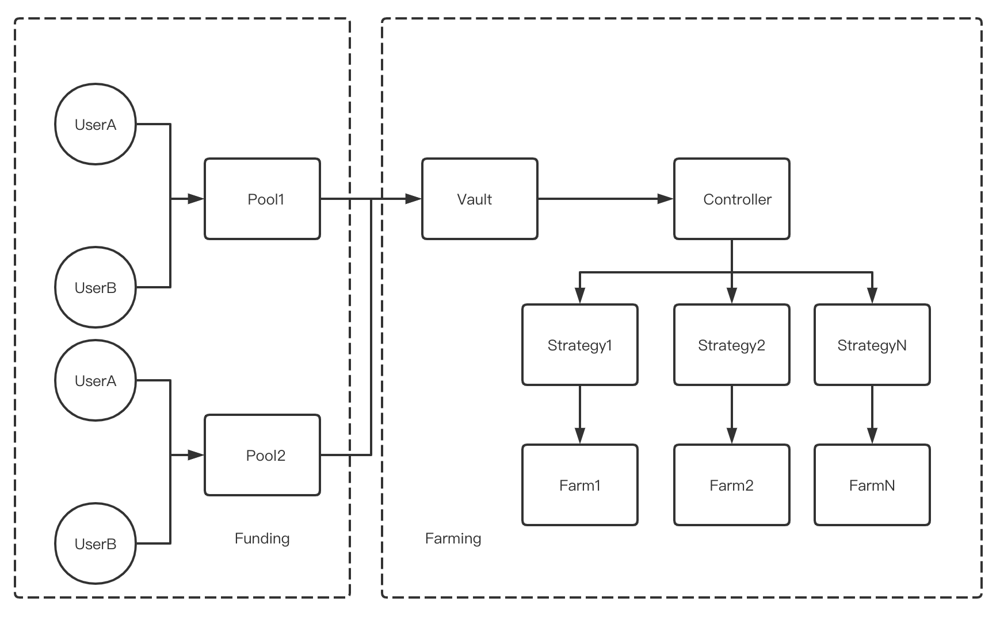

### 一、项目简介
Uniswap、Compound、YFI作为2020年的明星项目引爆了加密货币世界的Defi市场，然而一直存在用户操作门槛高、受限于链上资产的问题。yFarming Protocol是一个旨在引入增量用户和增量资产的去中心化Defi聚合挖矿协议，在社区治理和去中心化的基础上，能够让用户用零手续费挖矿，并且可以引入真实世界中的资产和信用来配资挖矿资金杠杆，解决用户“挖矿门槛高、挖矿资金不够用”的痛点，从而让用户充分享受Defi世界红利。

##### yFarming Protocol具有以下独特优势：

零挖矿手续费：采用智能聚合挖矿算法，为用户省去动辄上百美金gas手续费，并给予手续费100%补贴，从而大大降低了用户到达Defi世界的门槛。
引入真实世界资产和信用实现杠杆挖矿：结合Synthetix合成资产上链框架及原创信任协同机制，通过智能合约完成链上合成资产权限管理和信任链条标记，从而让只有少量数字资产甚至0数字资产的用户，也可以引入真实世界资产和信用来配资放大Defi挖矿杠杆，起到“小投入、大收益“的杠杆作用，实现链上链下资产的利率套利，扩大Defi的底层资产价值。
易用性与可扩展性：yFarming Protocol通过可扩展的协议框架设计和友好的用户交互体验及功能集成，将成为用户进入Defi的入口级应用平台。

##### yFarming Protocol的发展路线是：

一、通过降低DeFi挖矿使用门槛，并将该费用聚合降低并提供100%补贴，来让更多区块链行业内人士能够参与到DeFi的实际运转中，将DeFi挖矿权从技术人员推广至行业内人士；

二、通过合成资产上链和信用协同机制，提高体系安全性以及优秀的交互设计，让行业外的金融需求者，例如来自传统领域的借贷双方，开始关注和使用去中心化的金融产品，即实现从行业内到行业外的推广；

三、打造开放技术框架协议和DAO社区治理机制，让 yFarming Protocol可以成为Defi基础设施和通用组件。

### 二、核心功能介绍
#### 1、零手续费聚合挖矿
本功能在YFI实现的基础上，实现基于智能算法的聚合挖矿模型，实现提升资金使用效率和聚合降低操作手续费的双重目标优化，并给予用户出入金手续费的100%代币补贴，从而大大降低用户的进入门槛。

#### 2、杠杆挖矿配资模式
Defi世界当前只能使用链上数字货币和资产进行挖矿和交易，使得Defi挖矿的无风险收益远高于真实世界的的优势无法充分发挥，Defi挖矿的矿工受限于手中有限的数字资产，无法充分享受Defi红利。而真实世界中的资金和资产追求低风险和相对于法币的收益率，使得很难接受Defi的流动性挖矿代币本位激励模型。为此，我们在 yFarming Pool提供杠杆挖矿配资模式，将矿工分为杠杆使用者A和杠杆提供者B，前者放大数字资产挖矿杠杆获取超额收益，后者获得法币本位的稳定收益并获得资金优先保护。例如面对APY为100%收益的矿池，A可以使用1万USDT并杠杆放大为5万USDT参与到挖矿中，并向提供4万USDT杠杆资金的B支法币本位APY为30%的杠杆利息。yFarming Pool通过智能合约模块组控制挖矿资金的流向，回流资金优先支付B的本金和利息。在这种情况下，假设挖矿APY不变，那么A的ROE将提升到380%，而B将获得相对法币的稳定收益。

#### 3、引入合成资产上链和信用协同的利率和杠杆率自动调节市场
在上述 yFarming Pool配资模型中，杠杆使用者可以利用杠杆实现超额收益，而杠杆的利率和比例将由市场化机制和智能合约实现。为了进一步引入真实世界中的资产和信任，yFarming Protocol采用类似Synthetix的合成资产机制和资产上链模型，杠杆使用者可以将真实资产抵押到链上，通过预言机实现价格联通，该链下真实资产将帮助杠杆使用者带来更低利率和更高比例的杠杆提供者，起到增信和劣后的作用。与此同时，yFarming 也将以真实世界信用为基底的区块链地址信用协同关系，通过多方安全计算将信用体系引入链上数字世界，从而为杠杆使用者提供增信和更优的杠杆使用方案，并设立信用协同保险池降低杠杆提供者的资金风险。

### 三、核心功能实现
在项目的第一阶段，依托 Ethererum 成熟智能合约技术，yFarming 用户所有资金来往与行为均在 Ethereum 链上由智能合约完成。鉴于 Ethererum 日益升高的交易手续费给用户带来了较大的负担，项目第二阶段会额外增加无需交易手续费用的公链支持，例如采用 DPos 机制的波场Tron。根据逻辑流程，yFarming 系统由 Pool，Vault，Controller，Strategy，Farm 五个模块构成，它们的交互关系如图1所示。

  
   
 图1. yFarming 各个模块逻辑示意图

图 1 中箭头的方向代表用户资金进行挖矿的流动方向，而用户获得收益的资金流动方向与图中箭头相反。下面我们依次介绍每个模块的逻辑功能，值得注意的是，所有的模块均是 Ethereum 上的智能合约，资金的流动是合约之间的函数调用。

yFarming 系统在逻辑层级上分成两个模块，分别是用户入金与配资的 Funding 模块；以及智能化挖矿 Farming 模块。前者依托后者运行，而后者是一个功能完善的子模块，可以作为独立的非用户配资模式的流动性挖矿系统独立运行。

对于 Funding 模块，其目的是满足两部分人不同需求，两部分人分别用 杠杆使用者UserA 与 杠杆提供者UserB 表示。对于UserA，其追求的是高风险高收益，例如 APY 100% 以上，但是缺乏足够的本金；而对于UserB，其有足够的本金，但是追求的是相对较高的稳定收益，例如 APY 30%。具体而言，Funding 模块的功能由一系列智能合约 Pool 实现，每个 Pool 是一个独立的资金池，包含如下功能：
##### a. 配资： 
   对于每个智能合约 Pool，其规定了接受资金种类，例如ETH，对于UserB的保底收益，例如 APY 30% 以及杠杆比例，例如300%。在此数值设置下，UserA 可以以 1：3 的比例由Pool 进行配资。如果 UserA 通过配资，即借 UserB 的钱，经流动性挖矿获得了超过 APY 100% 的收益，那么UserA 需要将配资部分收益的 30% 分给 UserB。对于每个Pool，UserA 会发布配资需求，UserB 可以根据需求将资金存储到 Pool 中，当然，UserB 也可以在没有足够需求的情况下将资金存储在 Pool 中，以备后续优先使用。

##### b. 清算：
   除了上述配资流程中对于收益的结算， Pool 还需要维护由于资产价值变化所造成的平仓清算等操作。UserA 通过配资会进而转投到 Vaunt 合约当中（关于 Vaunt 的介绍见后文），在Vaunt 中用户可能需要将资产进行转换，例如当前 Vaunt 当中收益率最高的币种为 YFI，而Pool的资金为ETH，那么UserA 可以首先通过一步转化将ETH 转换为 YFI 存入到Vaunt中。而ETH 与 YFI 的相对价格变化会影响 UserB 的本金安全。Pool 通过引入场外价格的预言机来进行判断，周期性判断是否触发平仓操作来保护 UserB 的资金安全。

对于 Farming 模块，总体而言，智能可约的关系可以概括为资金池 Vault 收集资金通过控制器 Controller 采用不同的策略 Strategy 将资金投到不同的流动性挖矿场景 Farm 中赚取收益。其资金的出入口为 Vaunt 智能合约，这是智能化自动挖矿的一系列不同资产，例如 ETH 与 YFI ，的聚合资金池，其汇集资金并且在挖矿结束后进行收益结算。总体而言。 作为 yFarming 系统的核心特色， Vault 在用户进行投资的时候，额外维护用户的邀请关系（例如用户可以通过制定一个地址作为自己的邀请者），进而在收益结算的时候进行一定比例或者数量的邀请分红。

当用户资金汇集到一个阈值后，Vaunt 会将将资金投入到具体的流动性挖矿挖矿场景 Farm 当中，这由控制器 Controller 进行统一管理。具体而言，Controller 首先代持用户的资金，其有一个可以被信任的挖矿策略 Strategy 的池子，每经过一段时间，Controller 会通过智能化算法与预言机模型，选择当前市场上收益率最高的策略进行投资。例如，假设当对市场 YFI 流动性挖矿收益最高的方式是投资到 Compound DeFi 当中，那么在更新节点之后，Controller 将会选择将 YFI 投入到 Compound 的 Strategy 来对 YFI 进行投资管理。 从上述表述中，可以看到 Strategy 主要完成两个功能：
a. 具体指定某种资产的挖矿链路。
b. 对流动性挖矿场景合约，即 Farm 合约的对接功能。

最后介绍流动性挖矿场景合约 Farming。当前人们已经比较熟悉Compound、Balancer等借贷或者去中心化交易等流动性挖矿场景，自然而然地，Farm 包括对此流动性挖矿场景的支持，即其作为 Farm 合约的一种，具有相应的 Strategy 对接以及预言机监控。对于 yFarming 而言，其创新性结合资产上链流程，支持实物资产流动性挖矿。具体而言，yFarming 采用 Synthetix 类似的机制来合成资产，但是与Synthetix 不同的是，用户在发布资产时可以选择合适的信用进行抵押，例如假设用户寻求发布 N 所住宅资产，代币数量为M， 这里的信用可以是一份具有法律效用的数字合约，约定当用户攒足 M/N 份代币即可兑换一所住宅。那么，以此为抵押（具体实现方式是将此数字合约放置于合成资产合约当中），用户即可在不需要代币抵押的前提下进行资产发布，进而进行流动性（交易）挖矿。

### 四、治理模式
DAO去中心化治理机制

yFarming Protocol在经过初期测试和代码设计后，将会上线使用。度过初期开发者委员会推动产品、社区冷启动后，yFarming 的治理将完全进入DAO阶段。该协议收YFX的约束，任何改进将由YFX持有者投票决定。该治理系统可以控制的部分权力列举如下：

设立新的挖矿矿池并选择合适的挖矿协议

更新预言机地址和杠杆资金利率和比例

更改收益后端抽成比例和方法方式

设立新的DAO community

### 五、代币模型
代币分发将完全采取去中心化模式，无私募、无预挖，社区治理社区受益。代币将依托智能合约自动分发，总计100万枚，分为3个阶段发放：

第一阶段：点亮计划。社区早期支持者采用快照模式，记录协议启动的点亮计划支持总资产并分发YFX Early Bird收益。

第二阶段：流动性挖矿。本阶段将采用类似YFI的流动性挖矿机制，设置多个矿池和机枪池为早期 Farmer 提供超额YFX收益。

第三阶段：杠杆配资挖矿。本阶段将引入挖矿配资模型，在 yFarming Pool内植入资金风控智能合约组件，并依据合成资产上链和信用协同机制，确定配资比例和利率，并为杠杆提供者和杠杆使用者提供YFX奖励。
